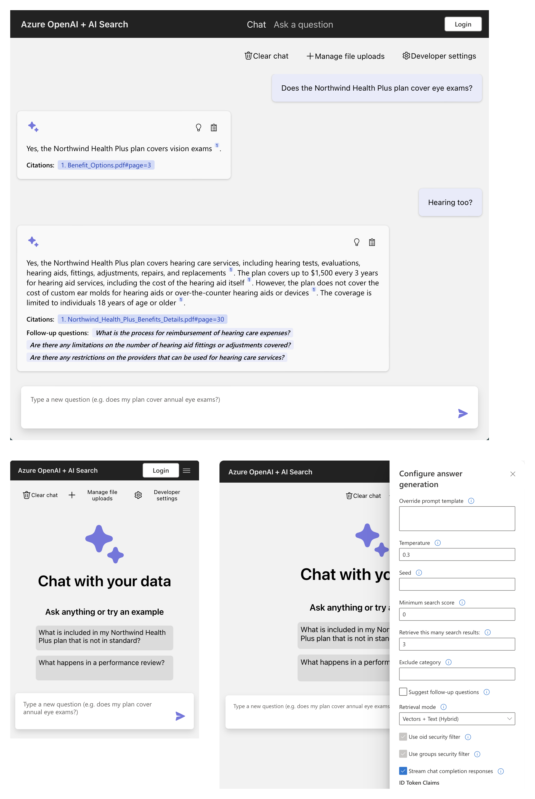
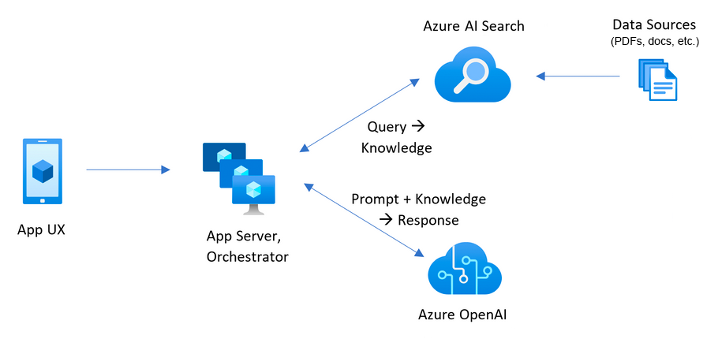

<!--
---
name: RAG chat app with your data (Python)
description: Chat with your domain data using Azure OpenAI and Azure AI Search.
languages:
- python
- typescript
- bicep
- azdeveloper
products:
- azure-openai
- azure-cognitive-search
- azure-app-service
- azure
page_type: sample
urlFragment: azure-search-openai-demo
---
-->

# RAG chat app with Azure OpenAI and Azure AI Search (Python)

This solution creates a ChatGPT-like frontend experience over your own documents using RAG (Retrieval Augmented Generation). It uses Azure OpenAI Service to access GPT models, and Azure AI Search for data indexing and retrieval.

This solution's backend is written in Python. There are also [**JavaScript**](https://aka.ms/azai/js/code), [**.NET**](https://aka.ms/azai/net/code), and [**Java**](https://aka.ms/azai/java/code) samples based on this one. Learn more about [developing AI apps using Azure AI Services](https://aka.ms/azai).

[](https://github.com/codespaces/new?hide_repo_select=true&ref=main&repo=599293758&machine=standardLinux32gb&devcontainer_path=.devcontainer%2Fdevcontainer.json&location=WestUs2)
[](https://vscode.dev/redirect?url=vscode://ms-vscode-remote.remote-containers/cloneInVolume?url=https://github.com/azure-samples/azure-search-openai-demo)
[](https://vscode.dev/azure?azdTemplateUrl=https://github.com/azure-samples/azure-search-openai-demo)

## Important Security Notice

This template, the application code and configuration it contains, has been built to showcase Microsoft Azure specific services and tools. We strongly advise our customers not to make this code part of their production environments without implementing or enabling additional security features. See our [productionizing guide](docs/productionizing.md) for tips, and consult the [Azure OpenAI Landing Zone reference architecture](https://techcommunity.microsoft.com/blog/azurearchitectureblog/azure-openai-landing-zone-reference-architecture/3882102) for more best practices.

## Table of Contents

- [Features](#features)
- [Azure account requirements](#azure-account-requirements)
  - [Cost estimation](#cost-estimation)
- [Getting Started](#getting-started)
  - [GitHub Codespaces](#github-codespaces)
  - [VS Code Dev Containers](#vs-code-dev-containers)
  - [Local environment](#local-environment)
- [Deploying](#deploying)
  - [Deploying again — infrastructure changes](#deploying-again--infrastructure-changes)
  - [Deploying again — app code changes only](#deploying-again--app-code-changes-only)
- [Running the development server](#running-the-development-server)
- [Using the app](#using-the-app)
- [Clean up](#clean-up)
- [Guidance](#guidance)
  - [Resources](#resources)



[📺 Watch a video overview of the app.](https://youtu.be/3acB0OWmLvM)

This sample demonstrates a few approaches for creating ChatGPT-like experiences over your own data using the Retrieval Augmented Generation pattern. It uses Azure OpenAI Service to access a GPT model (gpt-4.1-mini), and Azure AI Search for data indexing and retrieval.

The repo includes sample data so it's ready to try end to end. In this sample application we use a fictitious company called Zava, and the experience allows its employees to ask questions about the benefits, internal policies, as well as job descriptions and roles.

## Features

- Chat (multi-turn) interface
- Renders citations and thought process for each answer
- Includes settings directly in the UI to tweak the behavior and experiment with options
- Integrates Azure AI Search for indexing and retrieval of documents, with support for [many document formats](/docs/data_ingestion.md#supported-document-formats) as well as [cloud data ingestion](/docs/data_ingestion.md#cloud-data-ingestion)
- Optional usage of [multimodal models](/docs/multimodal.md) to reason over image-heavy documents
- Optional addition of [speech input/output](/docs/deploy_features.md#enabling-speech-inputoutput) for accessibility
- Optional automation of [user login and data access](/docs/login_and_acl.md) via Microsoft Entra
- Performance tracing and monitoring with Application Insights

### Architecture Diagram



## Azure account requirements

**IMPORTANT:** In order to deploy and run this example, you'll need:

- **Azure account**. If you're new to Azure, [get an Azure account for free](https://azure.microsoft.com/free/cognitive-search/) and you'll get some free Azure credits to get started. See [guide to deploying with the free trial](docs/deploy_freetrial.md).
- **Azure account permissions**:
  - Your Azure account must have `Microsoft.Authorization/roleAssignments/write` permissions, such as [Role Based Access Control Administrator](https://learn.microsoft.com/azure/role-based-access-control/built-in-roles#role-based-access-control-administrator-preview), [User Access Administrator](https://learn.microsoft.com/azure/role-based-access-control/built-in-roles#user-access-administrator), or [Owner](https://learn.microsoft.com/azure/role-based-access-control/built-in-roles#owner). If you don't have subscription-level permissions, you must be granted [RBAC](https://learn.microsoft.com/azure/role-based-access-control/built-in-roles#role-based-access-control-administrator-preview) for an existing resource group and [deploy to that existing group](docs/deploy_existing.md#resource-group).
  - Your Azure account also needs `Microsoft.Resources/deployments/write` permissions on the subscription level.

### Cost estimation

Pricing varies per region and usage, so it isn't possible to predict exact costs for your usage.
However, you can try the [Azure pricing calculator](https://azure.com/e/e3490de2372a4f9b909b0d032560e41b) for the resources below.

- Azure Container Apps: Default host for app deployment as of 10/28/2024. See more details in [the ACA deployment guide](docs/azure_container_apps.md). Consumption plan with 1 CPU core, 2 GB RAM, minimum of 0 replicas. Pricing with Pay-as-You-Go. [Pricing](https://azure.microsoft.com/pricing/details/container-apps/)
- Azure Container Registry: Basic tier. [Pricing](https://azure.microsoft.com/pricing/details/container-registry/)
- Azure App Service: Only provisioned if you deploy to Azure App Service following [the App Service deployment guide](docs/azure_app_service.md).  Basic Tier with 1 CPU core, 1.75 GB RAM. Pricing per hour. [Pricing](https://azure.microsoft.com/pricing/details/app-service/linux/)
- Azure OpenAI: Standard tier, GPT and Ada models. Pricing per 1K tokens used, and at least 1K tokens are used per question. [Pricing](https://azure.microsoft.com/pricing/details/cognitive-services/openai-service/)
- Azure AI Document Intelligence: SO (Standard) tier using pre-built layout. Pricing per document page, sample documents have 261 pages total. [Pricing](https://azure.microsoft.com/pricing/details/form-recognizer/)
- Azure AI Search: Basic tier, 1 replica, free level of semantic search. Pricing per hour. [Pricing](https://azure.microsoft.com/pricing/details/search/)
- Azure Blob Storage: Standard tier with ZRS (Zone-redundant storage). Pricing per storage and read operations. [Pricing](https://azure.microsoft.com/pricing/details/storage/blobs/)
- Azure Cosmos DB: Only provisioned if you enabled [chat history with Cosmos DB](docs/deploy_features.md#enabling-persistent-chat-history-with-azure-cosmos-db). Serverless tier. Pricing per request unit and storage. [Pricing](https://azure.microsoft.com/pricing/details/cosmos-db/)
- Azure AI Vision: Only provisioned if you enabled [multimodal approach](docs/multimodal.md). Pricing per 1K transactions. [Pricing](https://azure.microsoft.com/pricing/details/cognitive-services/computer-vision/)
- Azure AI Content Understanding: Only provisioned if you enabled [media description](docs/deploy_features.md#enabling-media-description-with-azure-content-understanding). Pricing per 1K images. [Pricing](https://azure.microsoft.com/pricing/details/content-understanding/)
- Azure Monitor: Pay-as-you-go tier. Costs based on data ingested. [Pricing](https://azure.microsoft.com/pricing/details/monitor/)

To reduce costs, you can switch to free SKUs for various services, but those SKUs have limitations.
See this guide on [deploying with minimal costs](docs/deploy_lowcost.md) for more details.

⚠️ To avoid unnecessary costs, remember to take down your app if it's no longer in use,
either by deleting the resource group in the Portal or running `azd down`.

## Getting Started

This project is deployed with **Terraform** — no `azd` required. Infrastructure is defined in `infra/terraform/` and the app runs on Azure Container Apps.

### GitHub Codespaces

You can run this repo virtually by using GitHub Codespaces, which will open a web-based VS Code in your browser:

[](https://github.com/codespaces/new?hide_repo_select=true&ref=main&repo=599293758&machine=standardLinux32gb&devcontainer_path=.devcontainer%2Fdevcontainer.json&location=WestUs2)

Once the codespace opens (this may take several minutes), open a terminal window.

### VS Code Dev Containers

A related option is VS Code Dev Containers, which will open the project in your local VS Code using the [Dev Containers extension](https://marketplace.visualstudio.com/items?itemName=ms-vscode-remote.remote-containers):

1. Start Docker Desktop (install it if not already installed)
2. Open the project:
    [](https://vscode.dev/redirect?url=vscode://ms-vscode-remote.remote-containers/cloneInVolume?url=https://github.com/azure-samples/azure-search-openai-demo)

3. In the VS Code window that opens, once the project files show up (this may take several minutes), open a terminal window.

### Local environment

Install the required tools:

- [Python 3.10, 3.11, 3.12, 3.13, or 3.14](https://www.python.org/downloads/)
  - **Important**: Python and pip must be in your PATH. On Ubuntu: `sudo apt install python-is-python3`
- [Node.js 20+](https://nodejs.org/download/)
- [Terraform 1.5+](https://developer.hashicorp.com/terraform/install)
- [Azure CLI](https://docs.microsoft.com/cli/azure/install-azure-cli)
- [Git](https://git-scm.com/downloads)
- [PowerShell 7+ (pwsh)](https://github.com/powershell/powershell) — Windows only

## Deploying

The steps below provision all Azure resources and deploy the app to Azure Container Apps.

> **Cost notice**: The resources below will incur costs. Delete the resource group when not in use to avoid unnecessary charges (see [Clean up](#clean-up)).

### 1. Log in to Azure

```shell
az login --tenant <your-tenant-id>
```

### 2. Configure and apply Terraform

```powershell
# Copy the example tfvars and fill in your values
cd infra/terraform
cp environments/dev.tfvars.example environments/dev.tfvars
# Edit dev.tfvars — set principal_id to your Azure user object ID:
#   az ad signed-in-user show --query id -o tsv

terraform init
terraform apply -var-file=environments/dev.tfvars
```

All Azure services (OpenAI, AI Search, Storage, Cosmos DB, Container Apps, RBAC, etc.) are provisioned in one step.

### 3. Configure environment variables

```powershell
# Copy the example and fill in values from terraform output
cp .env.example .env
# In another terminal:
terraform -chdir=infra/terraform output
# Copy the output values into .env
```

See [`.env.example`](.env.example) for a full reference of all variables.

### 4. Create a Python virtual environment and install dependencies

```powershell
python -m venv .venv
.venv\Scripts\pip install -r app/backend/requirements.txt   # Windows
# .venv/bin/pip install -r app/backend/requirements.txt    # Linux/Mac
```

### 5. Ingest documents into Azure AI Search

```powershell
# Windows (uses integrated vectorization — creates indexer, skillset, data source)
.\scripts\prepdocs-terraform.ps1

# Linux/Mac
set -a && . ./.env && set +a
.venv/bin/python app/backend/prepdocs.py './data/*' --verbose
```

This uploads your documents from `./data/` to Azure Blob Storage and triggers the AI Search indexer to chunk, embed, and index them automatically on a daily schedule.

### 6. Build and deploy the app

```powershell
# Get resource names from Terraform output
$ACR = terraform -chdir=infra/terraform output -raw container_registry_name
$RG  = terraform -chdir=infra/terraform output -raw azure_resource_group
$APP = terraform -chdir=infra/terraform output -raw backend_service_name

# Build Docker image and push to Azure Container Registry
az acr build --registry $ACR --image azure-search-openai:latest app/ --no-logs

# Deploy to Container App
az containerapp update `
  --name $APP `
  --resource-group $RG `
  --image "$ACR.azurecr.io/azure-search-openai:latest"
```

The app URL is available from:

```powershell
terraform -chdir=infra/terraform output backend_uri
```

> NOTE: It may take 2-5 minutes after deployment for the Container App to become healthy. If you see an error page, wait and refresh.

### Deploying again — infrastructure changes

If you modify any Terraform files in `infra/terraform/`:

```powershell
terraform -chdir=infra/terraform apply -var-file=environments/dev.tfvars
```

### Deploying again — app code changes only

If you only change code in the `app/` folder, just rebuild and redeploy:

```powershell
az acr build --registry $ACR --image azure-search-openai:latest app/ --no-logs
az containerapp update --name $APP --resource-group $RG --image "$ACR.azurecr.io/azure-search-openai:latest"
```

## Running the development server

After deploying to Azure, you can run the frontend locally against the live Azure backend:

Windows:

```shell
./app/start.ps1
```

Linux/Mac:

```shell
./app/start.sh
```

VS Code: Run the **"VS Code Task: Start App"** task.

Navigate to `http://127.0.0.1:50505`.

See more tips in [the local development guide](docs/localdev.md).

## Using the app

- **In Azure**: navigate to the Container App URL from `terraform output backend_uri`.
- **Locally**: navigate to `http://127.0.0.1:50505`

Once in the web app:

- Try different topics in chat. Try follow up questions, clarifications, ask to simplify or elaborate on answer, etc.
- Explore citations and sources
- Click on "settings" to try different options, tweak prompts, etc.

## Clean up

To delete all resources provisioned by Terraform:

```powershell
terraform -chdir=infra/terraform destroy -var-file=environments/dev.tfvars
```

All resources in the resource group will be deleted.

## Guidance

You can find extensive documentation in the [docs](docs/README.md) folder:

- Deploying:
  - [Troubleshooting deployment](docs/deploy_troubleshooting.md)
    - [Debugging the app on App Service](docs/appservice.md)
  - [Deploying with azd: deep dive and CI/CD](docs/azd.md)
  - [Deploying with existing Azure resources](docs/deploy_existing.md)
  - [Deploying from a free account](docs/deploy_lowcost.md)
  - [Enabling optional features](docs/deploy_features.md)
    - [All features](docs/deploy_features.md)
    - [Login and access control](docs/login_and_acl.md)
    - [Multimodal](docs/multimodal.md)
    - [Reasoning](docs/reasoning.md)
    - [Private endpoints](docs/deploy_private.md)
    - [Agentic retrieval](docs/agentic_retrieval.md)
  - [Sharing deployment environments](docs/sharing_environments.md)
- [Local development](docs/localdev.md)
- [Customizing the app](docs/customization.md)
- [App architecture](docs/architecture.md)
- [HTTP Protocol](docs/http_protocol.md)
- [Data ingestion](docs/data_ingestion.md)
- [Evaluation](docs/evaluation.md)
- [Safety evaluation](docs/safety_evaluation.md)
- [Monitoring with Application Insights](docs/monitoring.md)
- [Productionizing](docs/productionizing.md)
- [Alternative RAG chat samples](docs/other_samples.md)

### Resources

- [📖 Docs: Get started using the chat with your data sample](https://learn.microsoft.com/azure/developer/python/get-started-app-chat-template?toc=%2Fazure%2Fdeveloper%2Fai%2Ftoc.json&bc=%2Fazure%2Fdeveloper%2Fai%2Fbreadcrumb%2Ftoc.json&tabs=github-codespaces)
- [📖 Blog: Revolutionize your Enterprise Data with ChatGPT: Next-gen Apps w/ Azure OpenAI and AI Search](https://techcommunity.microsoft.com/blog/azure-ai-services-blog/revolutionize-your-enterprise-data-with-chatgpt-next-gen-apps-w-azure-openai-and/3762087)
- [📖 Docs: Azure AI Search](https://learn.microsoft.com/azure/search/search-what-is-azure-search)
- [📖 Docs: Azure OpenAI Service](https://learn.microsoft.com/azure/cognitive-services/openai/overview)
- [📖 Docs: Comparing Azure OpenAI and OpenAI](https://learn.microsoft.com/azure/cognitive-services/openai/overview#comparing-azure-openai-and-openai/)
- [📖 Blog: Access Control in Generative AI applications with Azure AI Search](https://techcommunity.microsoft.com/blog/azure-ai-services-blog/access-control-in-generative-ai-applications-with-azure-ai-search/3956408)
- [📺 Talk: Quickly build and deploy OpenAI apps on Azure, infused with your own data](https://www.youtube.com/watch?v=j8i-OM5kwiY)
- [📺 Video: RAG Deep Dive Series](https://techcommunity.microsoft.com/blog/azuredevcommunityblog/rag-deep-dive-watch-all-the-recordings/4383171)

### Getting help

This is a sample built to demonstrate the capabilities of modern Generative AI apps and how they can be built in Azure.
For help with deploying this sample, please post in [GitHub Issues](/issues). If you're a Microsoft employee, you can also post in [our Teams channel](https://aka.ms/azai-python-help).

This repository is supported by the maintainers, _not_ by Microsoft Support,
so please use the support mechanisms described above, and we will do our best to help you out.

For general questions about developing AI solutions on Azure,
join the Azure AI Foundry Developer Community:

[](https://aka.ms/foundry/discord)
[](https://aka.ms/foundry/forum)

### Note

>Note: The PDF documents used in this demo contain information generated using a language model (Azure OpenAI Service). The information contained in these documents is only for demonstration purposes and does not reflect the opinions or beliefs of Microsoft. Microsoft makes no representations or warranties of any kind, express or implied, about the completeness, accuracy, reliability, suitability or availability with respect to the information contained in this document. All rights reserved to Microsoft.
