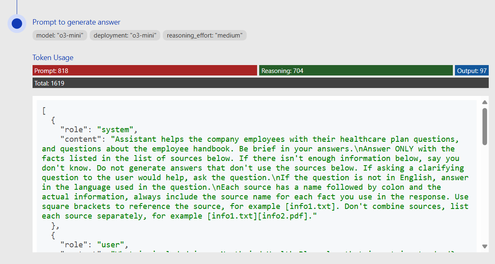

# RAG chat: Using reasoning models

This repository includes an optional feature that uses reasoning models to generate responses based on retrieved content. These models spend more time processing and understanding the user's request.

## Using the feature

### Supported Models

* gpt-5
* gpt-5-mini
* gpt-5-nano
* o4-mini
* o3
* o3-mini
* o1

### Prerequisites

* The ability to deploy a reasoning model in the [supported regions](https://learn.microsoft.com/azure/ai-services/openai/concepts/models#standard-deployment-model-availability). If you're not sure, try to create a o3-mini deployment from your Azure OpenAI deployments page.

### Deployment

1. **Enable reasoning:**

   Set the environment variables for your Azure OpenAI GPT deployments to your reasoning model

   For gpt-5:

   ```hcl
   chatgpt_model_name = "gpt-5"
   chatgpt_deployment_name = "gpt-5"
   chatgpt_deployment_version = "2025-08-07"
   chatgpt_deployment_sku_name = "GlobalStandard"
   ```

   For gpt-5-mini:

   ```hcl
   chatgpt_model_name = "gpt-5-mini"
   chatgpt_deployment_name = "gpt-5-mini"
   chatgpt_deployment_version = "2025-08-07"
   chatgpt_deployment_sku_name = "GlobalStandard"
   ```

   For gpt-5-nano:

   ```hcl
   chatgpt_model_name = "gpt-5-nano"
   chatgpt_deployment_name = "gpt-5-nano"
   chatgpt_deployment_version = "2025-08-07"
   chatgpt_deployment_sku_name = "GlobalStandard"
   ```

   For o4-mini:

   ```hcl
   chatgpt_model_name = "o4-mini"
   chatgpt_deployment_name = "o4-mini"
   chatgpt_deployment_version = "2025-04-16"
   chatgpt_deployment_sku_name = "GlobalStandard"
   ```

   For o3:

   ```hcl
   chatgpt_model_name = "o3"
   chatgpt_deployment_name = "o3"
   chatgpt_deployment_version = "2025-04-16"
   chatgpt_deployment_sku_name = "GlobalStandard"
   ```

   For o3-mini: (No vision support)

   ```hcl
   chatgpt_model_name = "o4-mini"
   chatgpt_deployment_name = "o4-mini"
   chatgpt_deployment_version = "2025-04-16"
   chatgpt_deployment_sku_name = "GlobalStandard"
   ```

   For o1: (No streaming support)

   ```hcl
   chatgpt_model_name = "o1"
   chatgpt_deployment_name = "o1"
   chatgpt_deployment_version = "2024-12-17"
   chatgpt_deployment_sku_name = "GlobalStandard"
   ```

2. **(Optional) Set default reasoning effort**

   You can configure how much effort the reasoning model spends on processing and understanding the user's request. Valid options are `minimal` (for GPT-5 models only), `low`, `medium`, and `high`. Reasoning effort defaults to `medium` if not set.

   Set the environment variable for reasoning effort:

   ```hcl
   reasoning_effort = "minimal"
   ```

3. **Update the infrastructure and application:**

   Execute `terraform -chdir=infra/terraform apply -var-file=environments/dev.tfvars` to provision the infrastructure changes (only the new model, if you ran `up` previously) and deploy the application code with the updated environment variables.

4. **Try out the feature:**

   Open the web app and start a new chat. The reasoning model will be used for all chat completion requests, including the query rewriting step.

5. **Experiment with reasoning effort:**

   Select the developer options in the web app and change "Reasoning Effort" to `low`, `medium`, or `high`. This will override the default reasoning effort of "medium".

   

6. **Understand token usage:**

   The reasoning models use additional billed tokens behind the scenes for the thinking process.
   To see the token usage, select the lightbulb icon on a chat answer. This will open the "Thought process" tab, which shows the reasoning model's thought process and the token usage for each chat completion.

   